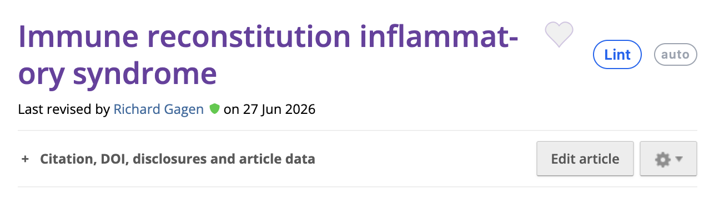

<div align="center">

# Radiopaedia Lint

**A `Lint` button next to the title of any [radiopaedia.org](https://radiopaedia.org) article.**

One click takes you to the editor, asks the [radiopaedia.work linter](https://radiopaedia.work/lint/linter?slug=epilepsy)
about that article, and lights the findings up *on the text itself* — coloured by severity, with
the message alongside, and keys to walk through them one at a time.

[](https://raw.githubusercontent.com/gmadevs/radiopaedia-lint-userscript/main/radiopaedia-lint.user.js)

[](https://github.com/gmadevs/radiopaedia-lint-userscript/releases/latest)
[](LICENSE)
[](https://www.tampermonkey.net/)
[](radiopaedia-lint.user.js)



</div>

```
Lint  →  /edit  →  radiopaedia.work/lint/linter?slug=…  →  findings lit on the text
```

---

## Contents

- [Installing](#installing)
- [Working through the findings](#working-through-the-findings)
- [How it works](#how-it-works)
- [Troubleshooting](#troubleshooting)
- [License](#license)

---

## Installing

**1. Install [Tampermonkey](https://www.tampermonkey.net/).**

**2. Open [`radiopaedia-lint.user.js`](https://raw.githubusercontent.com/gmadevs/radiopaedia-lint-userscript/main/radiopaedia-lint.user.js).**
Tampermonkey recognises any URL ending in `.user.js` and offers to install it; from then on it
checks the same URL for updates on its own. Failing that: Dashboard → **+** (new script) → paste
the file → save.

**3. Chrome and Edge only — turn on user scripts.**

> [!IMPORTANT]
> Open `chrome://extensions` (or `edge://extensions`), find Tampermonkey, and turn on
> **Allow user scripts** — on some versions it is **Developer mode** instead. Without it,
> Tampermonkey lists the script as enabled and runs nothing, silently.

**4. Reload an article page.** The console should carry one line:

```text
[Radiopaedia Lint] active · /articles/epilepsy · slug: epilepsy · button: next to the title
```

That line is the quickest answer to *"why is there no button"*: if it is missing, the script is
not running at all, and nothing about where the button gets placed matters yet.

> [!NOTE]
> You need to be signed in to Radiopaedia with edit rights, since the whole point is the editor.

---

## Working through the findings

<div align="center">
  
</div>

Findings are highlighted in place, one is always current, and the bottom bar keeps the count.

### Keyboard

While you are typing in the editor those letters have to stay letters — so there, the shortcuts
move to <kbd>Alt</kbd>.

| Action | On the page | While typing in the editor |
| :-- | :-- | :-- |
| Next finding | <kbd>j</kbd> | <kbd>Alt</kbd> + <kbd>→</kbd> |
| Previous finding | <kbd>k</kbd> | <kbd>Alt</kbd> + <kbd>←</kbd> |
| Mark done | <kbd>s</kbd> | <kbd>Alt</kbd> + <kbd>Enter</kbd> |
| Ignore | <kbd>x</kbd> | <kbd>Alt</kbd> + <kbd>Backspace</kbd> |
| Undo the last verdict | <kbd>u</kbd> | — |
| Copy the message | <kbd>c</kbd> | — |
| Close | <kbd>Esc</kbd> | — |

Everything is on the bottom bar too, including **Re-lint** to ask the linter again after you have
saved.

### Severity

| | Severity | Colour |
| :-: | :-- | :-- |
| 🔴 | `error` | red |
| 🟠 | `warning` | amber |
| 🔵 | `suggestion` | blue |

### The note stays out of the way

It goes below the highlighted words, or above, or to the side — whichever lands clear — and it
never repeats the snippet, because you are already looking at it. When a finding is so tall that
nothing fits beside it, hovering the note fades it out of the way.

---

## How it works

<details>
<summary><strong>The text is never touched</strong></summary>

<br>

The highlight is a layer of rectangles laid over the page, drawn from the `getClientRects()` of
the ranges and redrawn on every scroll. **Not a single tag goes into the editor content.**
Wrapping the snippets in `<mark>` would have been simpler and would have published those `<mark>`
elements inside the article the first time you hit save.

</details>

<details>
<summary><strong>The anchor is the snippet, not the line</strong></summary>

<br>

`line:column` shifts the moment anyone adds a paragraph above, and the editor's lines are not the
linter's lines anyway. So the quoted snippet is searched for in the text instead — ignoring
spacing, case, curly quotes, and **zero-width spaces**, which Radiopaedia articles are full of.
The linter quotes the "Radiographic features" heading with a U+200B stuck to the front, and `\s`
in JavaScript does not cover that character: one invisible thing, and the snippet is never found.

Once the snippet is located, if the message names a precise piece — `'SUDEP' has no definition` —
the highlight tightens onto that. One lit acronym is worth more than a paragraph washed in
colour. On the `epilepsy` article that is 11 findings out of 11 anchored, 9 of them narrowed to
the exact word.

</details>

<details>
<summary><strong>"Done" is a word you say</strong></summary>

<br>

The linter lints the **published** article, not what is sitting in your form: the findings are a
snapshot of how things were before you started, and they do not recompute while you fix them.
What can be checked for free is checked — the moment a snippet can no longer be found in the
text, its finding closes itself, which is also how you see that a fix landed. <kbd>u</kbd>
reopens it.

Verdicts are **not kept**: close the tab and they are gone. That is deliberate rather than
missing. This button is for the short loop — *"I am on this article, show me what is wrong with
it"* — and a second memory of verdicts that never talks to the first one is worse than one.

</details>

<details>
<summary><strong>One request here is one request there</strong></summary>

<br>

The linter reads the article from Radiopaedia on your behalf, so a request to it is a request to
them. This is a human pressing a button on one article at a time, which is fine — and it is why
there is no prefetching, no automatic retry, and why the answer is kept in `sessionStorage` so
reloading the edit page does not ask twice.

> [!WARNING]
> Please do not wrap this in anything that clicks by itself.

</details>

---

## Troubleshooting

| Symptom | Likely cause | Fix |
| :-- | :-- | :-- |
| No button, and no `[Radiopaedia Lint] active` line in the console | The script is not running | Chrome/Edge: turn on **Allow user scripts** for Tampermonkey (step 3 above) |
| Button is there, no findings come back | The linter's Tailwind classes changed | See *What can break it* below |
| Findings come back, nothing is highlighted | A different editor, or a snippet that cannot be found in the text | See `EDITOR_SELECTORS` below |

<details>
<summary><strong>What can break it</strong></summary>

<br>

**The linter's Tailwind classes**, which are not an API: `extract()` reads findings out of
`div[data-flux-card]`, `[data-flux-heading]`, `[data-flux-badge]` and `div.pb-6`. New stylesheet,
no findings.

**The editor selectors**, in `EDITOR_SELECTORS` near the top: TinyMCE in an iframe and plain
contenteditables are covered. A different editor gets added there.

**The title**, which has broken it once already. Signed in, the page carries two `h1` elements,
and the one belonging to the user menu (`media-heading user-menu-name`, zero by zero) comes first
in the document. `querySelector` with a list of selectors returns the first matching *element*,
not the first matching *selector*, so the button was being mounted inside something invisible —
and signed out, where that `h1` does not exist, everything looked fine. `visibleTitle()` now
skips anything that takes up no room, and after mounting, the button's own rectangle is measured:
if it comes back zero, it moves to the top right corner. An ugly button you can see beats a
well-placed one you cannot.

</details>

---

## License

[MIT](LICENSE) © Giorgio Maria Agazzi

Not affiliated with Radiopaedia.org. The linting itself is done by
[radiopaedia.work](https://radiopaedia.work/); this script is the button, the highlighting and
the walk-through.
