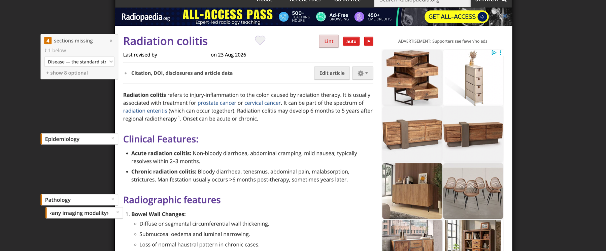
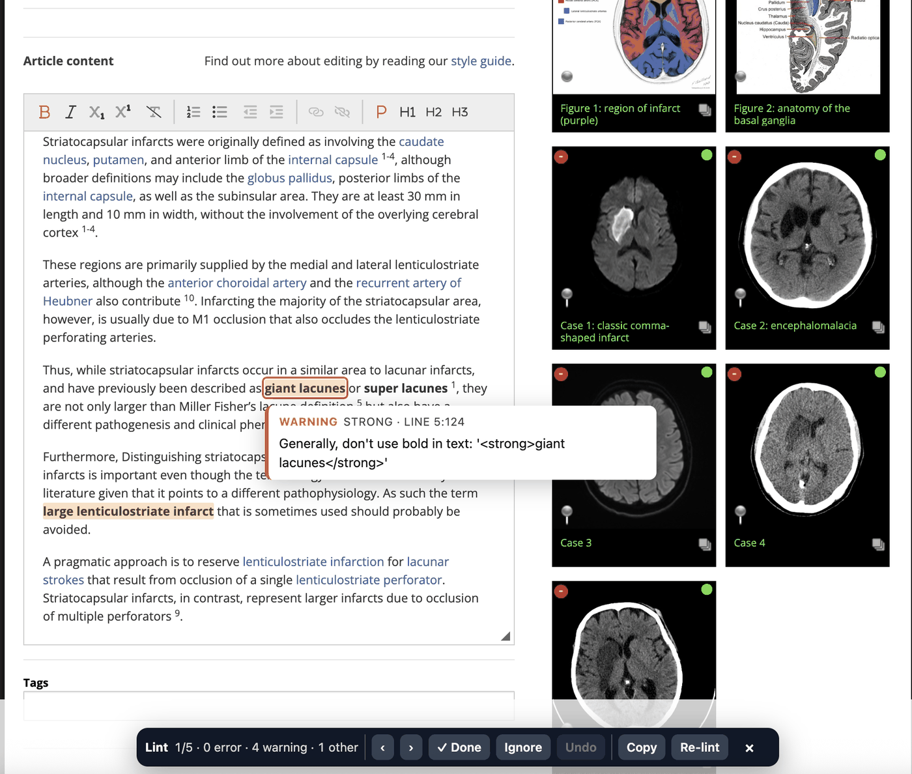

<div align="center">

# Radiopaedia Lint

**A `Lint` button next to the title of any [radiopaedia.org](https://radiopaedia.org) article.**

Click it and the findings come back lit up *on the text itself* in the editor — coloured by
severity, with the message alongside, and keys to walk through them one at a time. Turn its
**auto** switch on and it does not wait to be clicked: every article you open goes to the
[radiopaedia.work lint API](https://radiopaedia.work/api/v1/lint?article=epilepsy) and the button
takes the colour of what came back, so you know before clicking.

And in the grey margin beside the text, the sections **this kind of article is supposed to have
and has not got** — each one beside the heading it would go under. The `⚑` next to the switch
turns that off.

Two of the linter's checks never reach you at all: the proper nouns that may open a list item and
the acronyms that need no spelling out are **[two shared lists](#proper-nouns-and-acronyms)** in
this repository, and <kbd>p</kbd> proposes the next one to them.

And beside every reference in the editor, a **`Lint citation`** chip: one press asks
[radiopaedia.work/cite](https://radiopaedia.work/cite) what that reference should say, and
[tells you what differs](#linting-the-references) — down to the word.

[](https://raw.githubusercontent.com/gmadevs/radiopaedia-lint-userscript/main/radiopaedia-lint.user.js)

[](https://github.com/gmadevs/radiopaedia-lint-userscript/releases/latest)
[](LICENSE)
[](https://www.tampermonkey.net/)
[](radiopaedia-lint.user.js)
[](radiopaedia-lint.user.js)
[](https://github.com/gmadevs/radiopaedia-lint-userscript/commits/main)



</div>

```
page opens   auto  →  radiopaedia.work/api/v1/lint  →  the button takes the colour of the worst
                                                       🔴 error 🟠 warning 🔵 suggestion ⚪ none

click              →  that same answer, from the cache  ┬─  nothing to fix  →  a banner, you stay
                      (or the first one, in manual)     └─  findings        →  /edit, on the text

same answer's       →  what kind of article this is  →  the sections its kind must have
article_type                                            └─  the ones missing, in the left margin
```

---

## Contents

- [Installing](#installing)
- [The colour of the button](#the-colour-of-the-button)
- [Nothing to lint](#nothing-to-lint)
- [Working through the findings](#working-through-the-findings)
- [Proper nouns and acronyms](#proper-nouns-and-acronyms)
- [Linting the references](#linting-the-references)
- [The sections that are missing](#the-sections-that-are-missing)
  - [Required and offered](#required-and-offered)
  - [Above it, or inside it](#above-it-or-inside-it)
  - [When the sections are out of order](#when-the-sections-are-out-of-order)
  - [A chip is beside a heading or it is nowhere](#a-chip-is-beside-a-heading-or-it-is-nowhere)
  - [The canon itself](docs/canon.md)
- [How it works](#how-it-works)
- [Troubleshooting](#troubleshooting)
- [License](#license)

---

## Installing

This is a **userscript**, not an extension. You install a userscript manager once — every major
browser has one, Safari included — and from then on the script updates itself from this repository
and the manager stays out of the way. That is also why there is nothing to install per browser
here: it is the same one file everywhere.

**1. Install a userscript manager.**

<div align="center">

[](https://chromewebstore.google.com/detail/tampermonkey/dhdgffkkebhmkfjojejmpbldmpobfkfo)
[](https://microsoftedge.microsoft.com/addons/detail/tampermonkey/iikmkjmpaadaobahmlepeloendndfphd)
[](https://addons.mozilla.org/firefox/addon/tampermonkey/)
[](https://apps.apple.com/app/userscripts/id1463298887)

</div>

| browser | what to install | worth knowing |
| :-- | :-- | :-- |
| Chrome | [Tampermonkey](https://chromewebstore.google.com/detail/tampermonkey/dhdgffkkebhmkfjojejmpbldmpobfkfo) | needs step 3 |
| Edge | [Tampermonkey](https://microsoftedge.microsoft.com/addons/detail/tampermonkey/iikmkjmpaadaobahmlepeloendndfphd) | needs step 3 |
| Firefox | [Tampermonkey](https://addons.mozilla.org/firefox/addon/tampermonkey/) | nothing extra |
| Safari | [Userscripts](https://apps.apple.com/app/userscripts/id1463298887) — free, macOS and iOS | enable it in Safari → Settings → Extensions, and give it permission on `radiopaedia.org` |

[Violentmonkey](https://violentmonkey.github.io/) works just as well on the first three, and
Safari also has [Tampermonkey Classic](https://apps.apple.com/app/tampermonkey/id1482490089) if
you would rather stay with the same name everywhere. Nothing in this script is particular to one
of them: it asks for `GM_xmlhttpRequest` and `GM_addStyle` and nothing else.

**2. Open [`radiopaedia-lint.user.js`](https://raw.githubusercontent.com/gmadevs/radiopaedia-lint-userscript/main/radiopaedia-lint.user.js).**
The manager recognises any URL ending in `.user.js` and offers to install it; from then on it
checks the same URL for updates on its own. Failing that: Dashboard → **+** (new script) → paste
the file → save.

**3. Chrome and Edge only — turn on user scripts.**

> [!IMPORTANT]
> Open `chrome://extensions` (or `edge://extensions`), find Tampermonkey, and turn on
> **Allow user scripts** — on some versions it is **Developer mode** instead. Without it,
> Tampermonkey lists the script as enabled and runs nothing, silently.

**4. Reload an article page.** The console should carry one line:

```text
[Radiopaedia Lint] active · /articles/epilepsy · slug: epilepsy · mode: automatic · button: next to the title
```

That line is the quickest answer to *"why is there no button"*: if it is missing, the script is
not running at all, and nothing about where the button gets placed matters yet.

> [!NOTE]
> You need to be signed in to Radiopaedia with edit rights, since the whole point is the editor.

---

## The colour of the button

Next to the button there is a switch:

| | |
| :-- | :-- |
| **auto**, filled | every article you open is sent to the linter and the button colours itself |
| **auto**, hollow | manual: nothing is asked until you press `Lint`, the way it worked before |

The choice is remembered across sessions — one `rlx-auto` key in `localStorage`, nothing else
persists — and switching back to automatic asks about the article you are on straight away
rather than waiting for the next page.

In automatic mode, opening an article asks the linter about it and the button says the answer in
the colour of the worst thing in there — the same colours the highlights use in the editor, so it reads as the same
thing seen from further away. Hovering it gives you the count.

| | The button | The article |
| :-: | :-- | :-- |
| 🔴 | red | at least one `error` |
| 🟠 | amber | no errors, at least one `warning` |
| 🔵 | blue | only `suggestion`s |
| ⚪ | grey | nothing to fix |
| | pale, half-faded | still asking |

The answer is kept for the session, so the click that follows costs no second request — and on a
grey button it does not even need the editor: the *nothing to lint* banner comes back instantly.

> [!IMPORTANT]
> Automatic mode is one request per article page you open, where it used to be one per click,
> and the linter reads the article from Radiopaedia to answer it. It is kept to the article page
> itself (not its revisions, not the editor), it waits for a tab you are actually looking at
> rather than one the browser opened on a guess, it never retries, and it fails silently — a
> button that could not ask looks exactly like one that has not been asked. The switch turns it
> off for good; `PREVIEW_ON_LOAD` at the top of the script decides what a browser that has never
> touched the switch does.

---

## Nothing to lint

The button asks the linter **before** it takes you anywhere. An article the linter has nothing to
say about no longer costs you the trip to the edit page and the trip back: a banner says so, and
you stay where you are. **Re-lint** answers the same way — once the last finding is gone the bar
closes and the banner takes its place.

This is not an extra request. It is the same one, made a moment earlier: the answer is kept in
`sessionStorage`, and the edit page reads it from there instead of asking again.

> [!NOTE]
> Zero findings means zero findings. The answer is JSON, and anything that is not a lint result —
> a Cloudflare check, an error, an article the linter cannot read — is refused before it gets
> anywhere near the banner, so *"nothing to lint"* is never something a broken reader says by
> mistake.

---

## Working through the findings

<div align="center">
  
</div>

Findings are highlighted in place, one is always current, and the bottom bar keeps the count.

### Keyboard

While you are typing in the editor those letters have to stay letters — so there, the shortcuts
move to <kbd>Alt</kbd>.

| Action | On the page | While typing in the editor |
| :-- | :-- | :-- |
| Next finding | <kbd>j</kbd> | <kbd>Alt</kbd> + <kbd>→</kbd> |
| Previous finding | <kbd>k</kbd> | <kbd>Alt</kbd> + <kbd>←</kbd> |
| Mark done | <kbd>s</kbd> | <kbd>Alt</kbd> + <kbd>Enter</kbd> |
| Ignore | <kbd>x</kbd> | <kbd>Alt</kbd> + <kbd>Backspace</kbd> |
| Undo the last verdict | <kbd>u</kbd> | — |
| Copy the message | <kbd>c</kbd> | — |
| Add a name or an acronym | <kbd>p</kbd> | — |
| Move the bar to the other edge | <kbd>t</kbd> | — |
| Close | <kbd>Esc</kbd> | — |

Everything is on the bottom bar too, including **Re-lint** to ask the linter again after you have
saved. Nothing on this list happens by itself: editing the text can close a finding, but only
these move you to another one.

### The bar keeps out of the way

It measures what is under it before it settles: a sticky promo strip, the Tags field, anything the
page has pinned to the bottom edge — the bar sits **above** it rather than on top of it, and
re-measures as you scroll and resize. When the automatic answer is wrong, <kbd>t</kbd> moves it to
the top edge instead, where it does the same thing under the site's header, and it stays where you
put it.

The count reads in the colours the highlights already use — `3/12 · 🔴 1 · 🟠 3 · 🔵 8` — and a
severity with nothing left in it simply disappears. When the last finding is reviewed the numbers
give way to what you did, `All reviewed · 9 fixed · 3 ignored`, and the buttons that no longer do
anything go with them.

### Severity

| | Severity | Colour |
| :-: | :-- | :-- |
| 🔴 | `error` | red |
| 🟠 | `warning` | amber |
| 🔵 | `suggestion` | blue |

One table, two places: these are the colours of the highlights, of the note beside them, and of
the button before you ever click it.

### The note stays out of the way

It goes below the highlighted words, or above, or to the side — whichever lands clear — and it
never repeats the snippet, because you are already looking at it.

When a finding is so tall that nothing fits beside it, reach the note with the pointer: it fades
**and stops catching the mouse**, so you can select the text underneath as if it were not there.
Its own message is a keystroke away either way — <kbd>c</kbd>, or **Copy** on the bar.

---

## Proper nouns and acronyms

Two of the linter's checks are right about the rule and blind to the exception, and both are
answered by a file in this repository rather than shown to you.

*"In general, we don't start a list item with a capital letter. Exceptions are proper nouns."* On
a radiology article a good half of those capitals **are** proper nouns — Alvarado, Meckel,
Langerhans, the British Thoracic Society — and the linter has no way to know which.
[`proper-nouns.txt`](proper-nouns.txt) is the list of them, one name per line, matched by
**prefix**: `Alvarado` covers "Alvarado score" and every other item that opens with it.

*"'ELISA' has no definition. Spell it out if it's unfamiliar to the audience."* A good few are not
unfamiliar to anybody reading the article, and others are not abbreviations to expand at all but
the name of a trial or a scoring system — YEARS, PERC, PIOPED, RANO.
[`acronyms.txt`](acronyms.txt) is the list of those, matched by **whole word**: `PE` covers "PE"
and nothing else, so "PET" and "PE-RADS" each need their own line.

Radiopaedia's own exception mechanism exists but is open to their editors only, so this is the
second best thing. Either way the finding is not shown at all, and the bar says how many were set
aside — `1/18 · 1 error · 3 warning · 14 other · 2 known names · 1 known acronym` — because a
decision to hide something belongs next to the numbers it changed, not behind them.

When the word is **not** in its file yet, the note says so and <kbd>p</kbd> adds it: the word goes
to your clipboard and the right file opens on GitHub, where you paste it in and press *Propose
changes*. GitHub turns that into a fork and a pull request on its own, so no write access and no
git are needed — and once it is merged, everybody running the script gets it. Words you have
proposed are remembered locally, so the same one is not offered again on the next article while
the pull request is still open.

> [!IMPORTANT]
> An entry hides that finding for **everybody** running the script. The bar for `acronyms.txt` is
> "no radiologist reading this article needs it spelled out", not "I know what it means" — and an
> acronym that means two things depending on the sentence (ER, US, GE, NB, TX) belongs nowhere
> near it. On those the linter is doing its job.

The lists are read once per tab and cached; **Re-lint** asks for them again. On top of that
GitHub's raw CDN keeps its own copy for about five minutes, so a word that has just been merged
takes a few minutes to arrive. If a file cannot be read at all, nothing is hidden and nothing is
offered for it — an unreadable list is not an empty one, and the findings come through exactly as
the linter sent them.

> [!NOTE]
> These and [the canon](#the-sections-that-are-missing) are the only reasons the script talks to
> a second host, `raw.githubusercontent.com`, and it only ever reads. Nothing is sent there: what
> reaches the repository is what you type into GitHub yourself. Every request the script makes,
> and everything it stores, is written out in [SECURITY-NOTES.md](SECURITY-NOTES.md).

---

## Linting the references

The linter checks the prose. Nothing checks the reference list at the bottom, which is where a
journal gets abbreviated the wrong way, a year is off by one, three authors appear where the style
wants *et al*, and two references end up numbered 2.

There is a tool that knows: **[radiopaedia.work/cite](https://radiopaedia.work/cite)** takes a
reference, works out what to look up in it — a DOI, a PMID, an ISBN, a URL — asks Crossref or
PubMed or Google Books, and gives back the canonical form. The edit page keeps each reference in
a box of its own with a **Format citation** link under it, and the chip goes right there, beside
it:

```
┌──────────────────────────────────────────────────────────────────────────┐
│ 1. Benson D, Cavanaugh M, … Nucleic Acids Res. 2013;41(Database issue):… │
└──────────────────────────────────────────────────────────────────────────┘
  Format citation   [ Lint citation ]
                            │
    press it, and that one reference goes to the tool ──┘

   ✓ citation   word for word what the tool returns
   ≠ citation   it differs — or the number in front of it does
   ? citation   nothing in there to look up
```

Where it differs, the two forms are shown one under the other with **the words that changed lit
up** — a reference is eighty words long and what is wrong with it is usually one of them — and
**`Copy as 4.`** puts the corrected line on the clipboard **as source**, `<a href>` tags and all,
which is what the box holds and what pasting into it needs; the number is the one the reference
ought to have, taken from where it actually stands in the list. You paste it over the old one
yourself: this script has never written a character inside the editor, and a citation is not the
place to start. <kbd>Esc</kbd>
closes the panel; the `❝` beside the **Lint** button turns the chips off.

The number gets its own verdict. A reference whose text is perfect but which is numbered `2` in
third place sends every `2` marker in the article to the wrong paper, and that is worth saying out
loud rather than burying in a diff.

> [!NOTE]
> **One press, one lookup.** The tool asks somebody else's API at the far end of it — Crossref,
> PubMed, Google Books — so nothing here is ever asked for on its own initiative: no lookup on
> page load, none for the references you did not press. What came back is kept for the tab, so
> pressing the same chip twice costs nothing.

> [!WARNING]
> **This one is scraping, and it is the only part of the script that is.** `/cite` has no JSON API
> yet, so the answer is read out of the `wire:snapshot` attribute Livewire leaves in the page it
> renders for `?search=…`. Four field names behind one attribute is a great deal better than the
> Tailwind classes this script used to read the findings out of before v1.5.0 — but it is still a
> thing that can change without warning, and when it does the chip will say so rather than lie.
> A `GET /api/v1/cite?search=…` alongside the lint API would retire this caveat.

---

## The sections that are missing

The linter checks the headings that **are** there. `Radiopaedia.HeadingsValid` says when one is
not recognised for that article type — *"Osteology" is not a recognised heading for this article
type* — and it never says anything about the heading that should be there and is not. This is the
other half, and the two do not overlap.

So: in the grey margin to the left of the text, one chip for each section the article has not got
— the ones Radiopaedia requires to begin with, its suggestions a click away — sitting **beside the
heading it would go under**. Miss `Pathology` and the chip lands next to `Radiographic features`,
because that is where the section goes. Miss something with nothing after it, and it lands at the
end of the text, because that is where *that* goes.

A **subsection** goes beside its parent instead, and that is not the same rule. What identifies
`Complications` is not what comes after it, it is what it sits inside: under `Clinical
presentation` it is the complication of the disease, under `Treatment and prognosis` it is the
complication of the treatment. Anchored by what the canon names next it would land against
`Pathology` and read as though it belonged there — and `Risk factors`, whose parent is
`Epidemiology`, would line up against `Clinical presentation`. The missing modality is this same
rule rather than a case of its own: its parent is `Radiographic features`.

```
      ┌──────────────────────┐
      │ 4  sections missing ×│   CSF overdrainage
      │ Disease           ▾  │   ────────────────
      │ + show 9 optional    │   CSF overdrainage, also known as overshunting, is …
      └──────────────────────┘
      ┌──────────────────────┐
      │ Epidemiology       × │   Clinical presentation
      └──────────────────────┘   Classically, patients present with headaches …
      ┌──────────────────────┐
      │ Pathology          × │   Radiographic features
      ├──────────────────────┤   Typical features of chronic overdrainage include:
      │ ‹any imaging modal…› │     • small "slit-like" ventricles
      └──────────────────────┘     • pachymeningeal thickening
```

The header sits level with the title, on the same line as the `Lint` button — it is the same kind
of thing, something about the article as a whole. That is also what makes the first chips land
right: every chip is kept below the header, and a header standing on the opening paragraph pushed
`Terminology` and `Usage` down past `Epidemiology`, which is the section they go above.

It stays for as long as there is anything to say, and *"there are nineteen optional ones you are
not looking at"* counts. Every control the rail has lives in that header, so a header that leaves
takes them with it — and on an article whose only missing sections were optional, hiding them
would have hidden the button that brings them back. The badge goes grey and reads `0` when nothing
required is missing: the rail is the one thing that has looked, so it says so.

Click a chip and the heading is on your clipboard, ready to paste into the editor. The `×` on it
says *this article does not need that one*, and it is remembered for that article; the `↺` in the
header brings them all back.

### Required and offered

Two things are being said, and they are two different axes, so they get two different signals.
**Whether Radiopaedia asks for it** is the left edge and the weight of the ink — amber and bold
for a section it requires, grey and light for one it merely offers. **Where it sits** is the
indent: a subsection is stepped in under the section it belongs to.

```
┃ ↑ Epidemiology       ×     amber, bold      Radiopaedia requires it
┃ ↑ Terminology        ×     grey, light      Radiopaedia offers it
    ┃ ↳ Genetics       ×     indented         a subsection, under a section that is there
```

### Above it, or inside it

A chip beside `Clinical presentation` that means *above this* and one beside `Epidemiology` that
means *inside this* were sitting in the same place and looking the same. Position cannot tell them
apart, so the chip says which:

| | |
| :-- | :-- |
| `↑` | goes **above** the heading it is beside |
| `↳` | goes **inside** it, as a subsection |
| `↓` | goes at the **end** of the article — there is nothing after it to come before |

Position also stops being an answer the moment the stack pushes a chip away from its heading,
which on a dense article is most of them. So put the pointer on a chip and a thread is drawn to
the heading itself, down the corridor between the margin and the text: it lands on the **top** of
the heading for a section — the line the new one would take — and on its **bottom** for a
subsection, where that section's own text begins. One at a time, because twenty threads across the
margin would be a worse answer than none.

Only the required ones are shown to begin with — `+ show 8 optional` in the header brings the rest,
and it stays on until you turn it off. The optional ones are filtered, or they would arrive thirty
at a time: a **subsection is only offered once the section it belongs under is there**, because
`Pathology/Genetics` on an article with no `Pathology` is the leaf before the branch. The nine
modalities are held back too — they are all children of `Radiographic features`, so on any article
with that section they would come nine at once, and what Radiopaedia asks for there is *one*,
which is already a required row of its own. A sub-modality like `Dual-energy CT` is not held back:
it appears only on an article that has a `CT` section, one at a time.

An article Radiopaedia asks nothing of — a sign, a device, a comparison — is offered nothing
either. Its canon is the standard one and reading the whole of it out as suggestions would be the
noise the requirement rules were written to avoid.

### When the sections are out of order

A missing heading is placed beside the sections it comes *before* — so "before" has to survive an
article whose sections are not in the canon's order. It is worked out from **the page, not the
canon**: of all the sections the canon puts after the missing one, the anchor is whichever is
highest on the page.

The two are the same answer on an article in order, and they part company on one that is not. Take
an article running `Radiographic features` and then `Clinical presentation`, and a missing
`Epidemiology`. The canon names Clinical presentation first — so anchoring by the canon puts the
chip *below* Radiographic features, beside the second of the two sections it is supposed to come
before. Epidemiology goes above both, so the anchor is whichever the reader meets first.

When any section is out of the canon's order the header says so, with `⇅`. The linter reports the
wrong-parent half of this itself, as `HeadingsValid`; what it costs here is that the placements on
that article are approximate, and that is worth saying where the placements are.

### One canon per kind of article, and which one

Radiopaedia does not have one structure, it has **twenty-three**: an anatomy article wants `Gross
anatomy` and `Variant anatomy` and has no business being asked for `Epidemiology`. All of them are
in [`article-structure.json`](article-structure.json) — 327 headings, their levels and their
parents, and which of them each kind of article is actually required to have. They are
**Radiopaedia's recommendations, not ours**, transcribed from their own article-structure pages.

Which one an article is measured against comes from `article_type` in the lint answer, and — since
that only separates a few kinds — from an ordered list of rules on the title for the rest. It gets
things wrong, and it is meant to: the menu in the rail header overrides it, and what you choose is
remembered for that article.

The whole of it — what is in the file, how the kind is decided and where each rule comes from, and
how to regenerate the file when Radiopaedia changes theirs — is in **[docs/canon.md](docs/canon.md)**.

### It costs no request of its own

`article_type` arrives in the lint answer, which is already cached for the session — so the rail
rides along on a request that was going to be made anyway, and appears **when a lint answer for
that article exists**: on load with **auto** on, on the click without it. Drawing it any earlier
would mean guessing the kind of article from the title alone, and the title alone cannot tell an
anatomy article from a disease. Six wrong chips are worse than none.

The `⚑` next to **auto** turns the whole thing off, and it stays off.

### When there is no margin

Radiopaedia centres a fixed 612px column, so the grey margin is whatever the window has left over:
about 490px at 1920, 250 at 1440, 175 at 1280, and nothing at all once the layout folds to one
column. Twenty of those pixels are the corridor the thread runs down and six are the breathing
room at the window's edge; what is left is the chip.

| window | chip |
| --: | --: |
| 1920 | 200px — the cap |
| 1440 | 200px |
| 1366 | 191px |
| 1280 | 148px |
| 1248 | 132px — the last one with words in it |
| below | **slim** |

Slim is a coloured tab against the edge of the text with the heading in its tooltip. Letting the
chips overlap the article would be lying about the space; saying less is not.

The article's own DOM is never touched, exactly as with the highlights. The chips are a layer over
the page, placed from the headings' own rectangles and moved on every frame that scrolls.

### A chip is beside a heading or it is nowhere

Scroll past a heading and its chip goes with it; reach the bottom of the window and the rest wait
their turn. Neither is a limitation worked around — it is what a margin note is. The first version
clamped every chip into the space under the header instead, so scrolling down a long article swept
them into a pile at the top left, twenty headings stacked against a paragraph none of them had
anything to do with; and on a short article with the optional ones showing, the stack ran off the
bottom of the window and kept going.

The header says how many are off screen in each direction — `↕ 3 above, 2 below` — and the count
badge's tooltip lists all of them, so nothing disappears without being counted.

---

## How it works

<details>
<summary><strong>Where the findings come from</strong></summary>

<br>

One `GET`, no key, JSON back. The `article` parameter takes a slug, an rID, or a whole
Radiopaedia URL:

```text
GET https://radiopaedia.work/api/v1/lint?article=pneumothorax
```

```jsonc
{
  "slug": "pneumothorax",
  "article_type": "general",
  "counts": { "error": 3, "warning": 12, "suggestion": 5 },
  "lints": [
    {
      "condition": "Radiopaedia.OxfordComma",   // the check → "Oxford Comma"
      "severity":  "suggestion",                // the colour
      "message":   "Use the Oxford comma in …", // the note beside the highlight
      "trimmed":   "Presentation is variable…", // the line as plain text → what is searched for
      "matched":   "deterioration, hypoxaemia and circulatory",   // → what is lit
      "line": 12,
      "position": 276                           // → which copy of it along that line
    }
  ]
}
```

`fromApi()` turns one entry into one finding, and that is the whole reading of the answer: seven
fields, named. Up to v1.4.2 there was no API and the findings had to be scraped out of the
linter's [rendered page](https://radiopaedia.work/lint/linter?slug=pneumothorax) — same findings,
but read through Tailwind classes that were never meant as an interface, at 400 kB and ~1.9 s a
click instead of 14 kB and ~0.6 s.

The page is still the better thing to *read*: it groups findings by check and explains them. The
script wants them one at a time, in article order, with the offending words marked — which is
what the API gives.

</details>

<details>
<summary><strong>The text is never touched</strong></summary>

<br>

The highlight is a layer of rectangles laid over the page, drawn from the `getClientRects()` of
the ranges and redrawn on every scroll. **Not a single tag goes into the editor content.**
Wrapping the snippets in `<mark>` would have been simpler and would have published those `<mark>`
elements inside the article the first time you hit save.

One box per line of text, though, not one per rectangle: a range is cut wherever it crosses a
tag, so a phrase with a link in the middle comes back in three pieces, and three outlined boxes
side by side read as three findings with borders running through the words. Rectangles sharing a
line are merged into one; a phrase that wraps keeps one box per line, which is what it looks
like.

</details>

<details>
<summary><strong>The anchor is the snippet, not the line</strong></summary>

<br>

`line:column` shifts the moment anyone adds a paragraph above, and the editor's lines are not the
linter's lines anyway. So the quoted snippet is searched for in the text instead — ignoring
spacing, case, curly quotes, and **zero-width spaces**, which Radiopaedia articles are full of.
The linter quotes the "Radiographic features" heading with a U+200B stuck to the front, and `\s`
in JavaScript does not cover that character: one invisible thing, and the snippet is never found.

Once the snippet is located, the highlight tightens onto the offending words themselves — the API
names them in `matched`, and `position` says which copy of them along the line, so on a sentence
with six commas in it the sixth is the one that lights up.

**Reference markers are not prose.** The commas inside `<sup>2,4,6,11,12</sup>` are commas on the
page and nothing else, and they are skipped when counting and when choosing what to light. Where
the linter's own position lands inside one — *"more than 5 commas in a single sentence"* is
reported against a comma of the citation — nothing is narrowed at all and the whole sentence
stays lit, which is what the message is about anyway. A rule that really is about citations, like
the spacing before one, still gets its highlight: those are skipped only while there is prose to
prefer.

**Where the fix is a character that is not there yet**, a highlight cannot say it. *"Use the
Oxford comma in 'patchy, reticulonodular or mixed'"* lights the phrase, and the phrase is not the
answer — the answer is one point inside it. Those findings get a caret drawn between the two
characters the comma belongs between, with the comma itself hanging under it, and the note prints
the phrase the way it should read:

```text
patchy, reticulonodular, or mixed
``` One lit acronym is worth more than a
paragraph washed in colour. On the `epilepsy` article that is 11 findings out of 11 anchored, all
11 narrowed to the exact words; across `pneumothorax`, `meningioma`, `appendicitis`,
`glioblastoma-idh-wildtype` and `striatocapsular-infarct`, 148 out of 148 anchored and 146
narrowed — the two that stay wide are `<strong> </strong>`, an empty bold tag, which is nothing
to point at once the markup is gone.

</details>

<details>
<summary><strong>"Done" is a word you say</strong></summary>

<br>

The linter lints the **published** article, not what is sitting in your form: the findings are a
snapshot of how things were before you started, and they do not recompute while you fix them.
What can be checked for free is checked — the moment a snippet can no longer be found in the
text, its finding closes itself, which is also how you see that a fix landed. <kbd>u</kbd>
reopens it.

**Closing it does not move you.** The note stays on the paragraph you are working on, turns green
and says *✓ fixed*; the highlight goes, the count drops, and nothing scrolls. Going to the next
finding is a key you press — <kbd>Alt</kbd> + <kbd>→</kbd> while you are typing — never something
your typing does to you.

Verdicts are **not kept**: close the tab and they are gone. That is deliberate rather than
missing. This button is for the short loop — *"I am on this article, show me what is wrong with
it"* — and a second memory of verdicts that never talks to the first one is worse than one.

</details>

<details>
<summary><strong>One request here is one request there</strong></summary>

<br>

The linter reads the article from Radiopaedia on your behalf, so a request to the API is a
request to them. Since the button colours itself on load, that is now one request per article
page you open rather than one per click — a real change, and the reason for every guard listed
[above](#the-colour-of-the-button): the article page only, a visible tab only, one answer per
article per session, no retry.

Everything downstream still reads that one answer. The edit page finds it in `sessionStorage`
instead of asking again, and so does the check that happens before the jump to the editor: the
article page asks, everything after it remembers.

The API itself is unauthenticated and rate-limited at 60 requests a minute — a number a person
reading articles will never come near, and a number a loop would reach in seconds.

> [!WARNING]
> Please do not wrap this in anything that clicks by itself.

</details>

---

## Troubleshooting

| Symptom | Likely cause | Fix |
| :-- | :-- | :-- |
| No button, and no `[Radiopaedia Lint] active` line in the console | The script is not running | Chrome/Edge: turn on **Allow user scripts** for Tampermonkey (step 3 above) |
| Button is there, no findings come back | The API's field names changed, or it is answering an error | See *What can break it* below |
| Findings come back, nothing is highlighted | A different editor, or a snippet that cannot be found in the text | See `EDITOR_SELECTORS` below |
| *"Article not found"*, or *"nothing in it to lint"* | The API's own answer (404 / 422) for that article | Check the slug in the URL; a stub with no text has nothing to lint |
| *"Cloudflare bot check"* | radiopaedia.work wants a human first | Open [radiopaedia.work](https://radiopaedia.work/) in a tab, clear the check, click again |
| No chips in the margin | No lint answer for that article yet | Turn **auto** on, or click **Lint** — the rail rides on that answer and asks for nothing of its own |
| No chips, and the linter has answered | Nothing required is missing, or the article is a kind Radiopaedia asks nothing of | Signs, devices, comparisons and biographies have no required sections; that is Radiopaedia's doing |
| The wrong sections are being asked for | The kind of article was guessed wrong | Change it in the menu in the rail header; it is remembered for that article |
| Chips are thin coloured tabs | The window is too narrow for words in the margin | Widen it past ~1250px, or read the headings from the tooltips |
| Fewer chips than the count says | Their headings are off screen | `↕ N above, M below` in the header says which way to scroll; the count badge's tooltip lists them all |
| `⇅` in the header | Some sections are not in the canon's order | The placements are approximate on that article; the linter reports the wrong-parent half of it separately |
| Only two or three chips, and you wanted more | Optional headings are hidden by default | `+ show N optional` in the header; it stays on |

<details>
<summary><strong>What can break it</strong></summary>

<br>

**The API's field names.** `fromApi()` reads `lints[]` and, in each entry, `condition`,
`severity`, `message`, `trimmed`, `matched`, `line` and `position`. A renamed field is what would
stop it — where the previous versions read the findings off the linter's HTML page, through
Tailwind classes that were never an API, and a new stylesheet was enough to break them silently.

**The editor selectors**, in `EDITOR_SELECTORS` near the top: TinyMCE in an iframe and plain
contenteditables are covered. A different editor gets added there.

**How Radiopaedia renders a heading.** The rail reads the article's sections off the page, and
the page spells an editor *Heading 1* as `<h4 class="section-title">`, a *Heading 2* as `<h5>`, a
*Heading 3* as `<h6>` — the page's own `<h1>` is the article title and its `<h2>`s belong to the
furniture (the "On this page" panel, References, Promoted articles). That mapping is
`ARTICLE_BODY`, `SECTION_SEL` and `TAG_LEVEL`, and if Radiopaedia ever changes the tags the rail
finds no sections at all and shows every required heading as missing — loudly wrong rather than
quietly, which is the way round it should be.

**`article_type`.** Drop that field from the lint answer and the rail stops guessing anatomy
correctly; it does not stop, it gets worse, which is harder to notice. It is read in one place,
in `findingsFor`.

**The title**, which has broken it once already. Signed in, the page carries two `h1` elements,
and the one belonging to the user menu (`media-heading user-menu-name`, zero by zero) comes first
in the document. `querySelector` with a list of selectors returns the first matching *element*,
not the first matching *selector*, so the button was being mounted inside something invisible —
and signed out, where that `h1` does not exist, everything looked fine. `visibleTitle()` now
skips anything that takes up no room, and after mounting, the button's own rectangle is measured:
if it comes back zero, it moves to the top right corner. An ugly button you can see beats a
well-placed one you cannot.

</details>

---

## License

[MIT](LICENSE) © Giorgio Maria Agazzi

Not affiliated with Radiopaedia.org. The linting itself is done by
[radiopaedia.work](https://radiopaedia.work/); this script is the button, the highlighting and
the walk-through.
